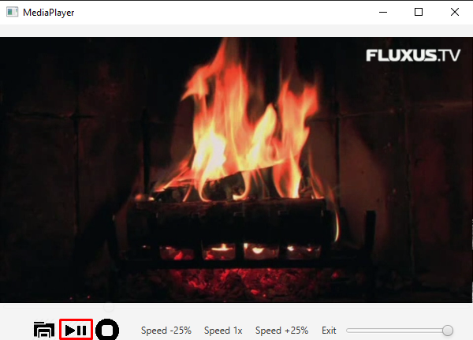

# Media Player based on JavaFX

## Features
- Support for mp3 and mp4
- Loading a file from a computer via default file manager
- Speeding up and down media
- Fullscreen mode - double-click and F key
- Scrolling through media
- Adjusting volume
- Jumping -/+ 10s - keys J/L
- Pausing video - key K
- Muting/unmuting - key M
- Spectrum visualizer when mp3 file loaded
- Changing spectrum color using keys - R - red, G - green, B - blue

## Manual (<a href="https://gitlab-stud.elka.pw.edu.pl/mdmowski/javamediaplayer/-/blob/master/doc/manual.md">Manual only</a>)


### Open a file you want to play

Use this button to choose a file you want to play


**Instructional video**


### Play and pause

Use this button to play and pause playback. You can press K to play and pause too.



**Instructional video**


### Stop playback

Use this button to stop playback. You can start from the beginning afterwards by clicking the play button. 


**Instructional video**


### Change volume and mute

Use this slider to change volume. Press M to mute and press again to unmute.


**Instructional video**


### Scrub through the file

Use this slider to scrub through the file


**Instructional video**


### Jump forward and backward

Press L to jump 10 seconds forward.
Press J to jump 10 seconds forward.
Press K to pause and play.

**Instructional video**


### Change playback speed

Use this buttons to change playback speed.


**Instructional video**


### Change color of the audio spectrum

If you have chosen mp3 file, audio spectrum will be visualised on the screen. You can change it's color by pressing keys:
R - red, G - green, B - blue.

**Instructional video**


### Open fullscreen

Press F or double-click on media to switch to full-screen mode. Press ESC to exit full-screen mode.


## How to run project
In order to run the project you should add the following VM Options ( easy using IntelliJ , Eclipse or Netbeans ) :

```
--add-exports javafx.controls/com.sun.javafx.scene.control.behavior=com.jfoenix
--add-exports javafx.controls/com.sun.javafx.scene.control=com.jfoenix
--add-exports javafx.base/com.sun.javafx.binding=com.jfoenix
--add-exports javafx.graphics/com.sun.javafx.stage=com.jfoenix
--add-exports javafx.base/com.sun.javafx.event=com.jfoenix
--add-exports javafx.graphics/com.sun.javafx.scene=org.controlsfx.controls,
--add-exports javafx.graphics/com.sun.javafx.scene.traversal=org.controlsfx.controls
```

