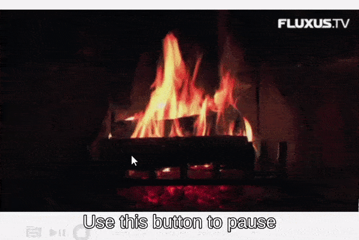
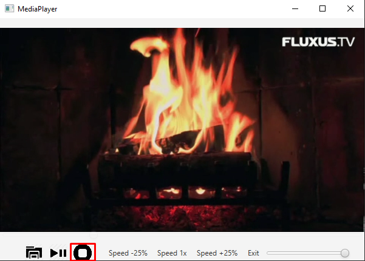
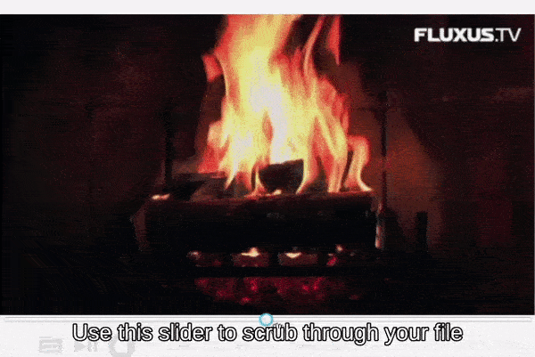
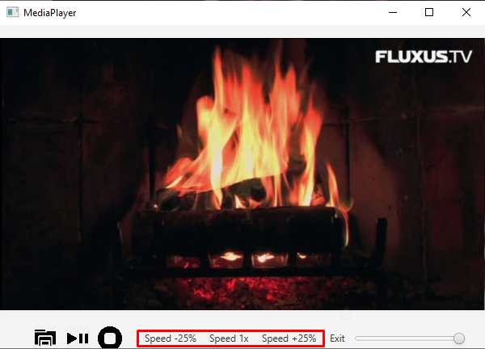
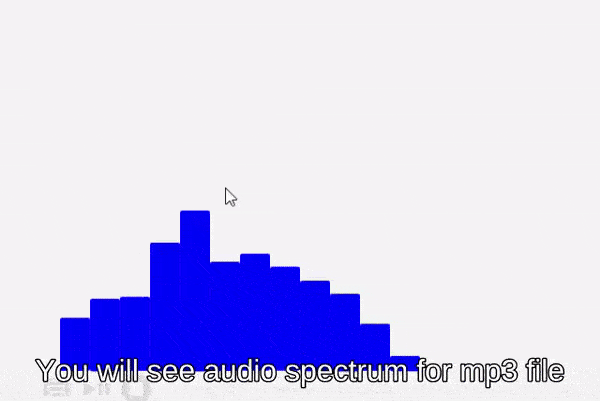

# Manual

## Open a file you want to play

Use this button to choose a file you want to play. Default file explorer will be opened,
and you will be asked to choose a file from your computer.
You will be able to choose only valid files -  mp3 and mp4 extensions. Other files won't be shown.

**Instructional video**

## Play and pause

Use this button to play and pause playback. You can press K to play and pause too.

**Instructional video**

## Stop playback

Use this button to stop playback. You can start from the beginning afterwards by clicking the play button. 

**Instructional video**

## Change volume and mute

Use this slider to change volume. Press M to mute and press again to unmute.

**Instructional video**

## Scrub through the file

Use this slider to scrub through the file.

**Instructional video**

## Jump forward and backward

Press L to jump 10 seconds forward.
Press J to jump 10 seconds forward.
Press K to pause and play.

**Instructional video**

## Change playback speed

Use this buttons to change playback speed.

**Instructional video**

## Change color of the audio spectrum

If you have chosen mp3 file, audio spectrum will be visualised on the screen. You can change it's color by pressing keys:
R - red, G - green, B - blue.

**Instructional video**

## Open fullscreen

Press F or double-click on media to switch to full-screen mode. Press ESC to exit full-screen mode.

### Exit program

Click on "Exit" button in the control panel or close the application window.

